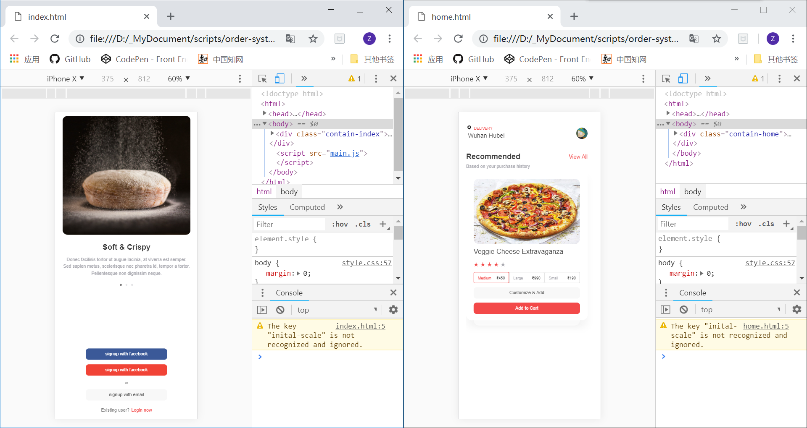
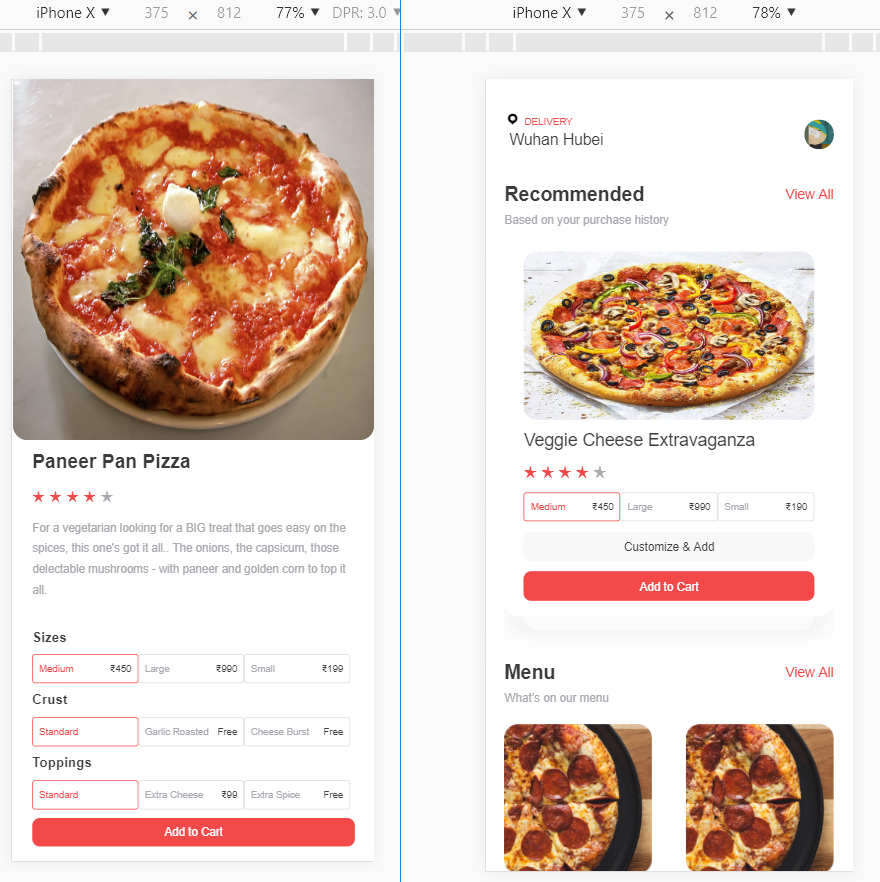
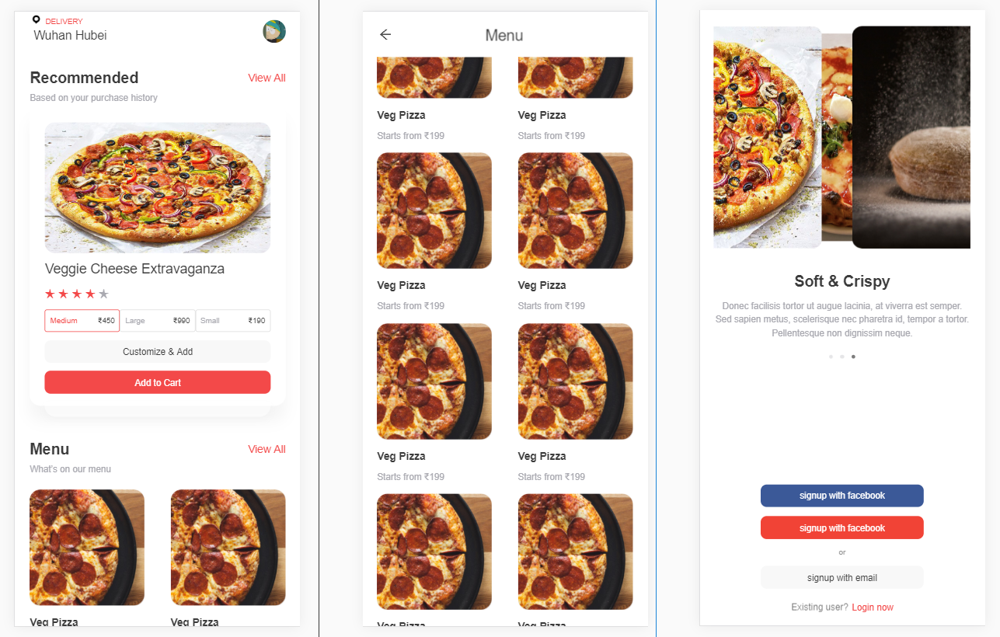
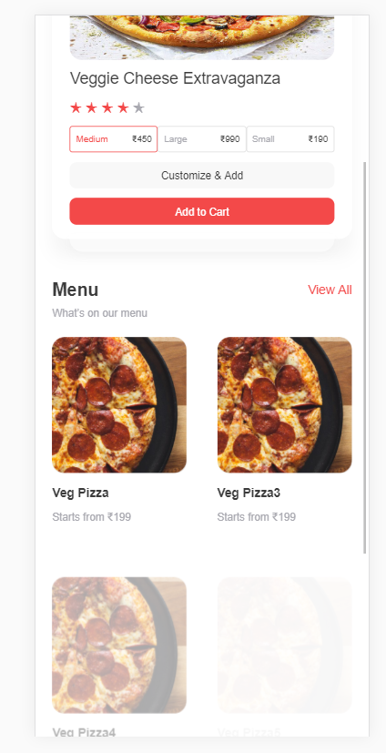

# 冰岩实习任务
一个手机端点餐系统

**第一天**

写了系统的登陆页面和主页的一个版块，解锁了用伪类点缀html元素的技能

今日效果如下：

**第二天**

写好了菜品详情的页面和主页面结构

小记：display flex 会与元素高（或宽）产生矛盾，overflow要多套一个div来解决

今日效果如下：

**第四天**

做了登陆界面的轮播动画以及Menu界面（其实是home界面下滑到指定区域时出现menu顶栏）

小记：

scrollTop = document.documentElement.scrollTop || document.body.scrollTop;

z-index无效的情况：

* 父标签 position属性为relative；

* 问题标签无position属性（不包括static）；

* 问题标签含有浮动(float)属性。

今日效果如下：

**第五天**

给menu做了瀑布流加载数据

小记：无

今日效果如下：

